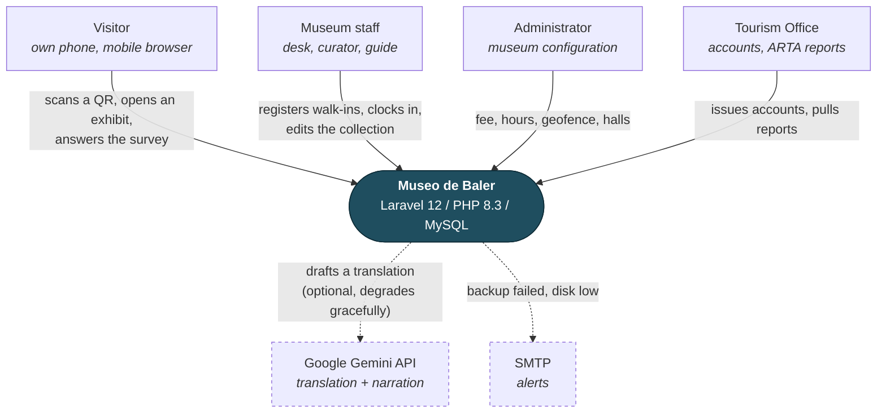
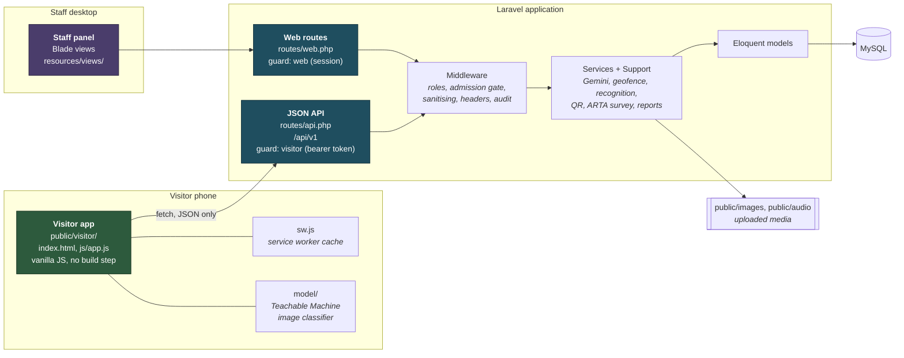
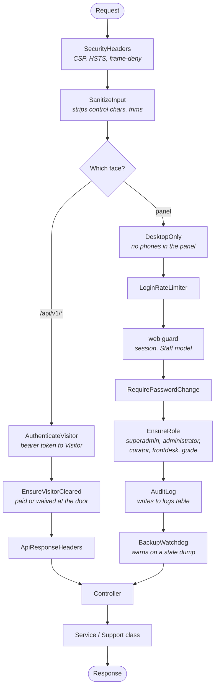
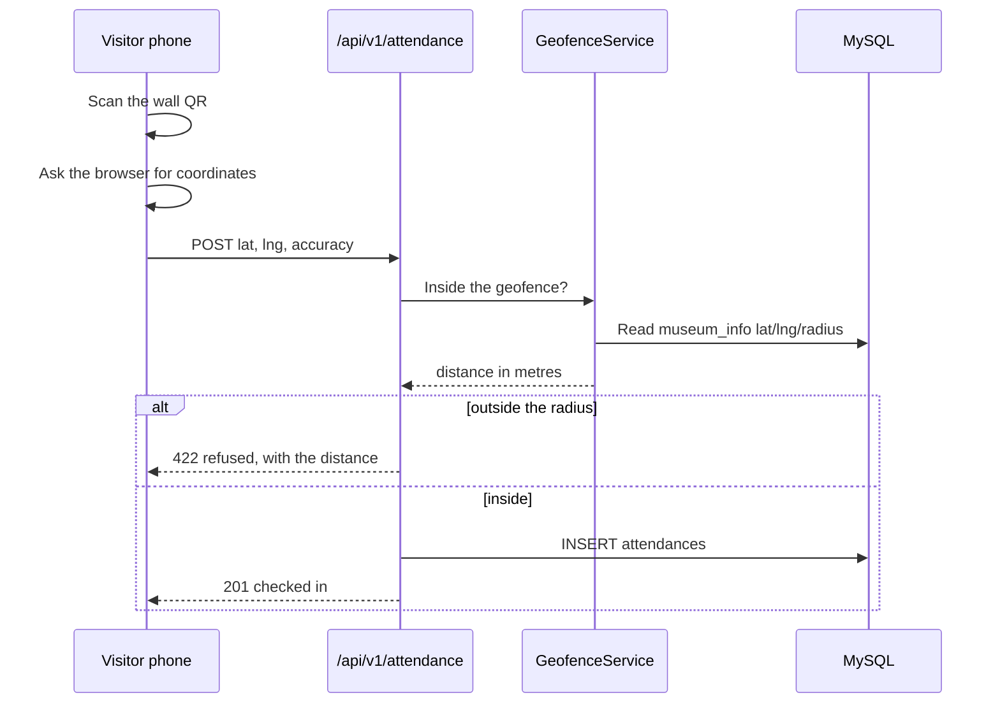
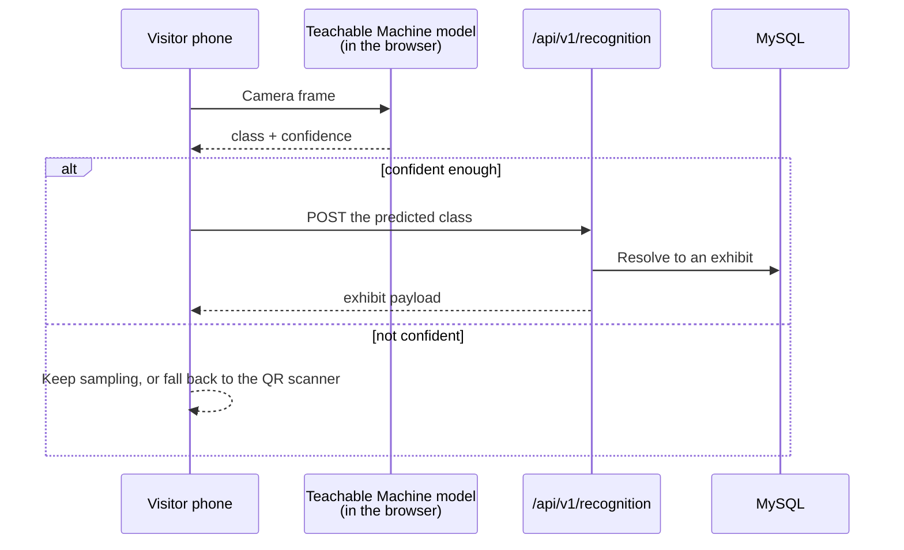
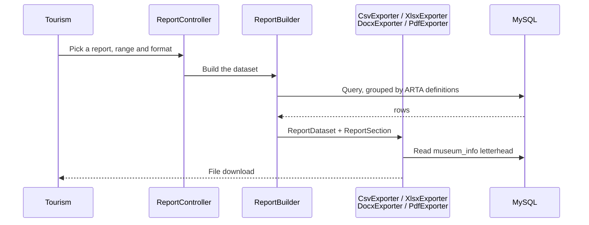
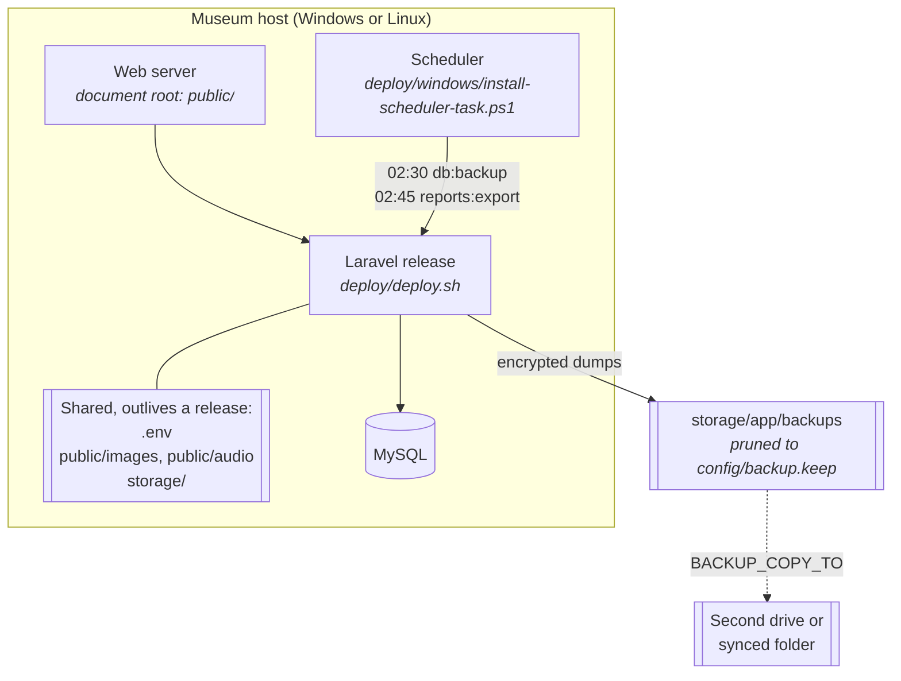

# System Architecture

Museo de Baler runs as one Laravel 12 application on PHP 8.3 that presents three
faces: a staff panel rendered server-side with Blade, a JSON API under
`/api/v1`, and an installable visitor web app of static files served from
`public/visitor/` that talks only to that API.

Diagrams below are Mermaid. Paste a block into <https://mermaid.live> to export
PNG or SVG for the manuscript.

---

## 1. Context: who touches the system



Both dashed dependencies are optional by design. If Gemini is unreachable the
museum still runs: translations are simply written by hand. See
[LIMITATIONS.md](LIMITATIONS.md).

## 2. The three faces



The visitor app never renders a Blade view and never holds a session cookie; the
panel never serves JSON to a phone. The `DesktopOnly` middleware enforces the
second half of that and `tests/Feature/DesktopOnlyTest.php` pins it.

## 3. Request pipeline

Every request passes the same ordered gates. The order matters: input is
sanitised before a controller sees it, and the audit log records the act only
after the role check has allowed it.



## 4. Three flows worth walking through

A panel will usually ask you to trace one request end to end. These are the
three that show the most.

### A visitor checks in at the door



The geofence centre and radius are rows in `museum_info`, not constants, so an
Administrator moves the boundary from the panel. This is also why a scan from
home is refused — the most common surprise during testing.

### A visitor identifies an exhibit by camera



Classification runs **on the phone**, not the server: the model is 3 MB of
static files in `public/visitor/model/` and the server is only asked to resolve a
class name to an exhibit row. That is what makes the feature work on a weak
signal, and why retraining means regenerating those files from
`exhibit_training_images`.

### Tourism exports the ARTA report



One dataset, four exporters. Adding a format means one new class in
`app/Support/Reports/`, not a fifth copy of the query.

## 5. Deployment



Full steps in [DEPLOYMENT.md](DEPLOYMENT.md); recovery in [RESTORE.md](RESTORE.md).

## 6. What is authored, and what is generated

A frequent question, because the folder on disk is much larger than the project.
**353 files are checked into version control.** Everything else on disk is either
generated by a tool or uploaded by a user, and all of it is listed in
`.gitignore`.

| On disk | Size | In the repo? | Where it comes from |
|---|---|---|---|
| `app/`, `routes/`, `resources/`, `config/`, `database/`, `tests/`, `docs/`, `public/visitor/` | ~4 MB | **Yes** — this is the project | Written by the team |
| `vendor/` | 170 MB | No | `composer install` reads `composer.lock` |
| `node_modules/` | 36 MB | No | `npm ci` reads `package-lock.json` |
| `public/images/`, `public/audio/` | 103 MB | No (`.gitkeep` only) | Uploaded exhibit photos and narration |
| `storage/app/backups/` | ~108 MB | No | `php artisan db:backup`, pruned automatically |
| `storage/logs/`, `storage/framework/` | ~11 MB | No | Runtime logs and compiled Blade cache |
| `public/build/` | ~1 MB | No | `npm run build` (Vite) |

The two lock files are the point: `composer.lock` and `package-lock.json` *are*
committed, and they pin every dependency to an exact version. That is why
`vendor/` does not need to be — any machine can rebuild it identically, and CI
does exactly that on every push before running the suite.

## 7. Directory map

```
app/
  Console/Commands/     backup, restore-key, report export, clear records, set password
  Http/Controllers/     the panel (18)
  Http/Controllers/Api/ the visitor API (/api/v1)
  Http/Middleware/      the 11 gates in section 3
  Models/               Eloquent (22); Visitor carries the door's logic
  Rules/                custom validation
  Services/             Gemini, geofence, recognition, image search, QR
  Support/              ARTA survey, password policy, backups, alerts
  Support/Reports/      ReportBuilder + the four exporters
bootstrap/, config/     framework wiring
database/
  migrations/           50 migrations; the schema in ERD.md
  seeders/media/        the seeded exhibits' pictures and audio
deploy/                 deploy.sh, rollback.sh, the Windows scheduler task
docs/                   this file and its neighbours
public/
  visitor/              the visitor app: index.html, js/app.js, sw.js, model/
  images/, audio/       uploads (git-ignored, shared across releases)
resources/views/        Blade: the panel, the print layouts, the mail
routes/
  web.php               the panel (118 routes)
  api.php               the visitor API
  console.php           the scheduled tasks
tests/
  Feature/              the panel, 45 files
  Feature/Api/          the visitor API
  Unit/                 pure logic
  js/                   the service worker, run by `npm test`
```
