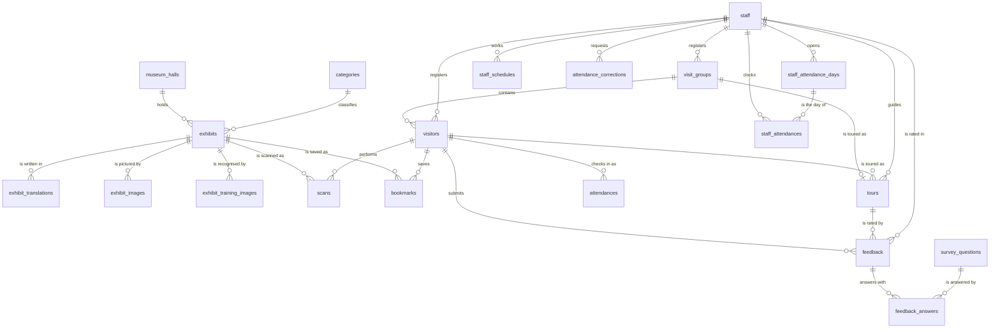
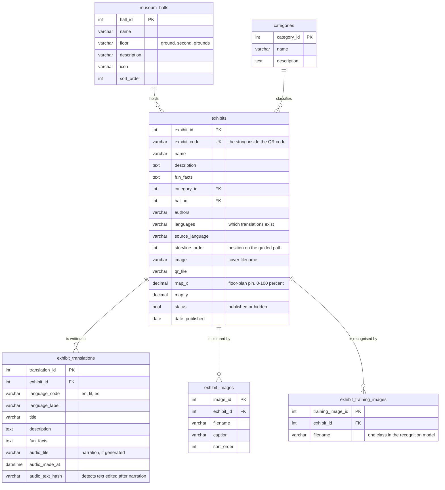
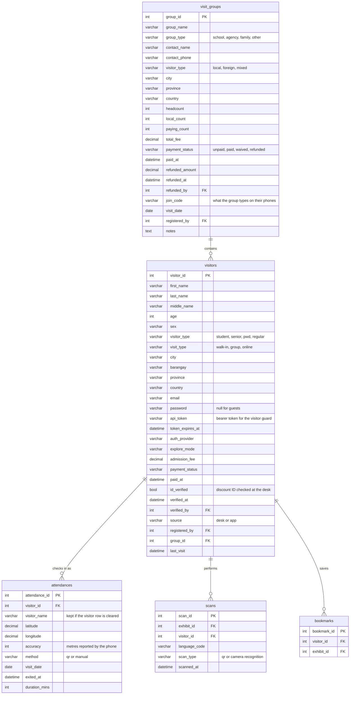
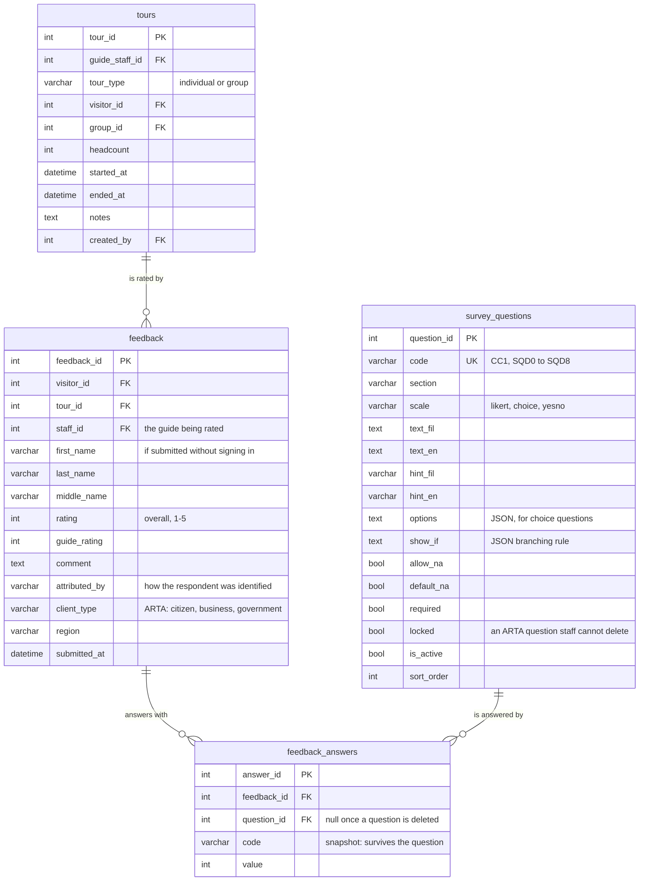
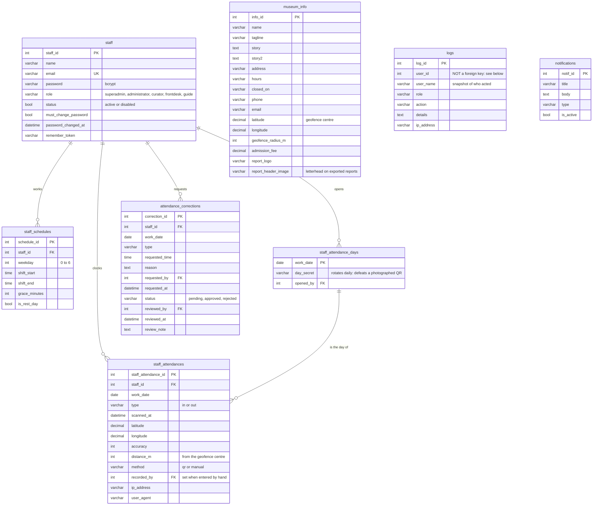

# Entity Relationship Diagram

The database as the migrations actually build it: 24 domain tables, plus 8 that
belong to the framework (`sessions`, `cache`, `cache_locks`, `jobs`,
`job_batches`, `failed_jobs`, `password_reset_tokens`, `migrations`) and are
left out of the diagrams below.

Every table uses a named primary key — `exhibit_id`, `visitor_id`, `staff_id` —
rather than a bare `id`. That is deliberate: a join reads as
`scans.exhibit_id = exhibits.exhibit_id` with no ambiguity about which `id` is
meant, and the same name carries through to the API and the CSV exports.

To put these diagrams in the manuscript, paste a block into
<https://mermaid.live> and export PNG or SVG. VS Code previews them inline with
the Markdown Preview Mermaid extension; so does GitHub.

---

## The whole picture

Relationships only. `||--o{` reads *one to zero-or-many*; `||--o|` is
*one to zero-or-one*.

`museum_info`, `logs` and `notifications` are standalone tables with no foreign
keys in either direction, so they do not appear above. `logs` having no key is
itself a design decision — see **Deliberate non-relationships**.

---

## 1. Exhibits and the collection

What the visitor app reads. An exhibit sits in a hall, belongs to a category,
and carries one row per language plus a gallery and a recognition training set.

## 2. Visitors, groups and the door

The admission path. A walk-in is a `visitors` row; a school or tour bus is one
`visit_groups` row carrying a `join_code` with many `visitors` under it.
`attendances` is the geofenced check-in; `scans` is one row per exhibit opened.

## 3. Tours and the ARTA survey

`survey_questions` holds the ARTA Client Satisfaction Measurement instrument as
data, not code, so Tourism can reword a question without a deployment.
`feedback_answers.code` is copied at submission time, which is why a report can
still be produced after a question is retired.

## 4. Staff, the DTR and the museum record

`staff_attendance_days` issues one rotating `day_secret` per working day. The
wall QR encodes that secret, so yesterday's photograph of the poster will not
clock anyone in today.

---

## Deliberate non-relationships

Three places where a foreign key is *absent* on purpose. Each is worth being
ready to explain, because each looks like an oversight until you say why.

**`logs.user_id` has no foreign key, and `logs.user_name` duplicates the name.**
An audit trail that cascades away when an account is deleted is not an audit
trail. The log keeps its own copy of who acted and in what role, so the record
of what a since-removed employee did survives their removal. Same reasoning for
`attendances.visitor_name`.

**`feedback_answers.code` duplicates `survey_questions.code`.** A survey answer
means whatever the question meant *at the time it was answered*. Copying the
code at submission lets Tourism retire or reword a question without rewriting
history, and lets a report still show a retired question's figures.
`question_id` goes null; `code` does not.

**`visitors` name columns are repeated on `feedback`.** Feedback can be
submitted without signing in. When it is, the name columns on `feedback` hold
what the respondent typed and `visitor_id` stays null.

## Notes for the panel

- **Why `staff` and not Laravel's `users` table.** The authentication provider
  in `config/auth.php` points at `App\Models\Staff` against the `staff` table.
  Museum employees are not generic users: they carry a role, a schedule, a DTR
  and a password lifecycle. Visitors authenticate through an entirely separate
  guard (`visitor`, a bearer token on `visitors`). Two populations, two tables,
  two guards, so a visitor can never hold a staff session.
- **`bookmarks` has no Eloquent model.** It is a join row with no behaviour,
  read through the query builder in the visitor API and in the reports.
- **Decimal, not float, for money and coordinates.** `admission_fee`,
  `total_fee`, `latitude` and `longitude` are `decimal`, so a peso figure and a
  geofence edge do not drift.
- **Cascades.** Deleting an exhibit removes its translations, images, training
  images and bookmarks. It does *not* remove its `scans`: visit statistics
  outlive the exhibit.
