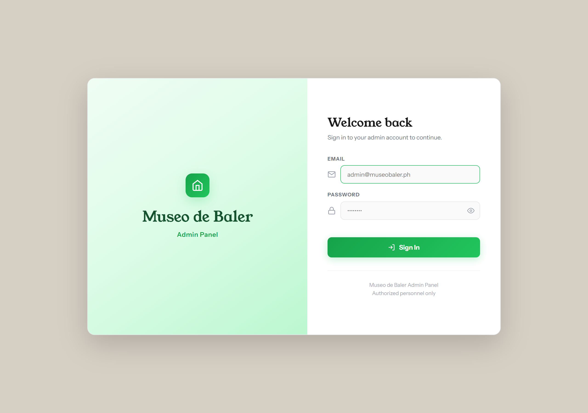
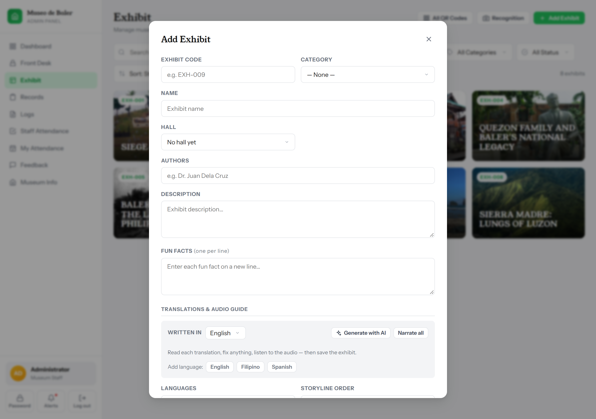
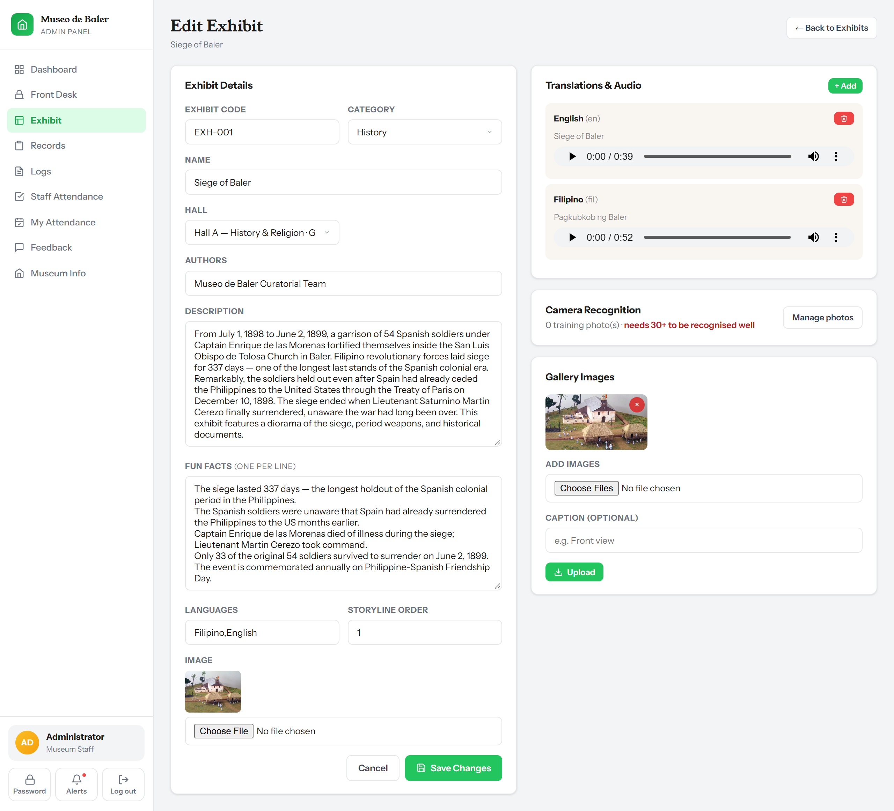
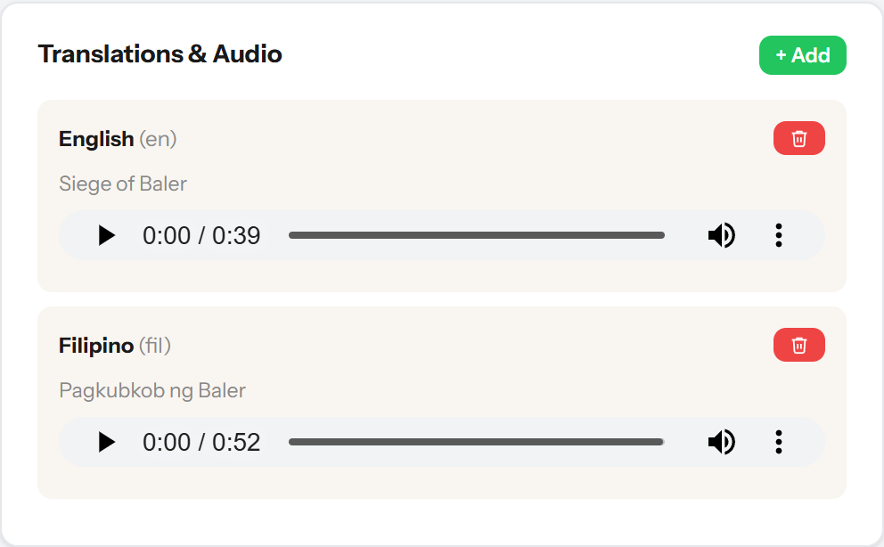
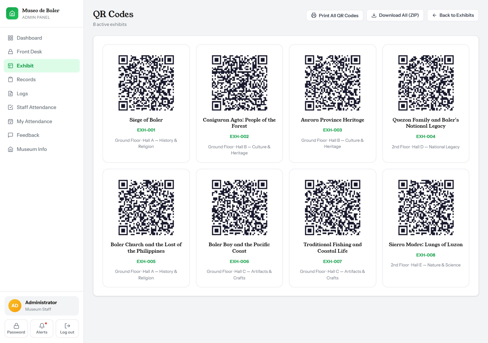
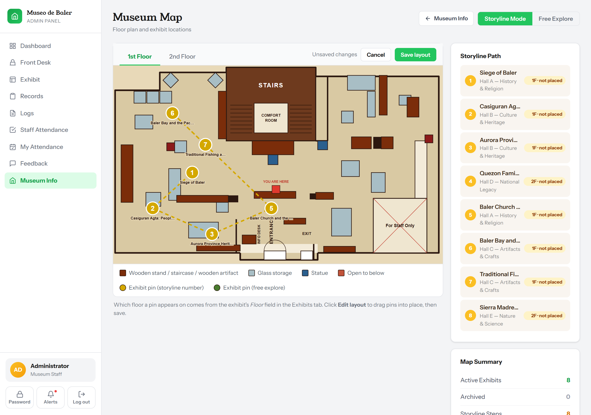
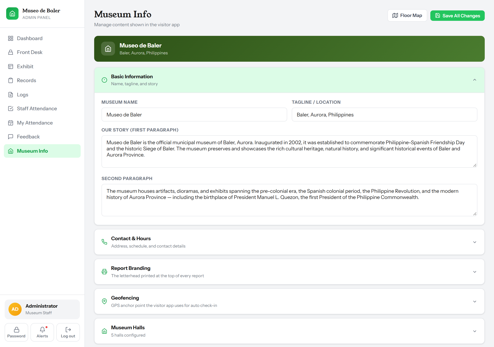
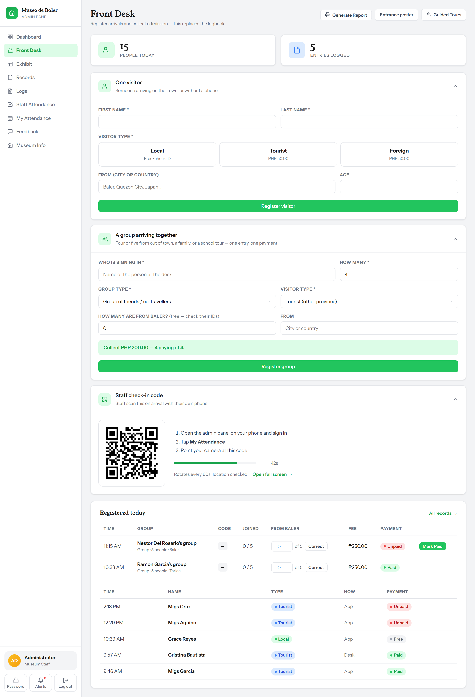
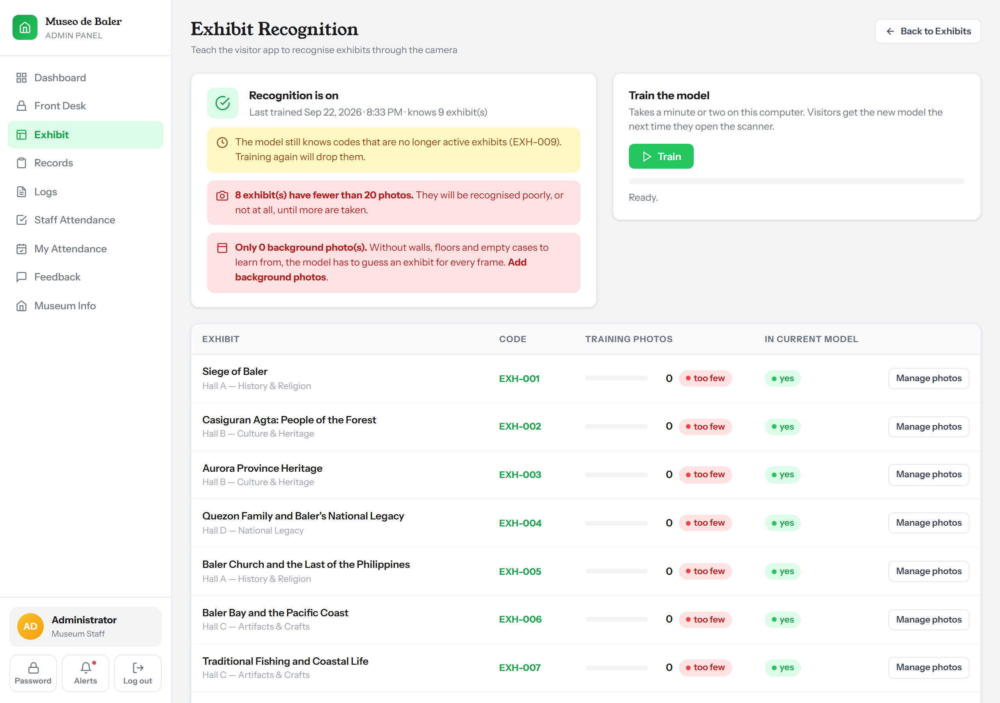

# Museo de Baler — Staff Manual

This is the day-to-day guide for the people who run the museum: the front
desk, the curators who write the exhibit labels, and the Tourism office that
oversees the staff. It assumes no technical background. Where it says
"the panel", it means the admin website you sign in to; where it says
"the app", it means what visitors open on their phones.

If something on a screen does not match this manual, the screen is right
and the manual is out of date — tell whoever maintains the system.

---

## Contents

1. [Signing in, and who can do what](#1-signing-in-and-who-can-do-what)
2. [Exhibits: create, edit, archive](#2-exhibits-create-edit-archive)
3. [Translations and the audio guide](#3-translations-and-the-audio-guide)
4. [QR codes for the display cases](#4-qr-codes-for-the-display-cases)
5. [The museum map](#5-the-museum-map)
6. [Museum info: hours, fee, halls, the geofence](#6-museum-info-hours-fee-halls-the-geofence)
7. [The front desk: admission, groups, refunds](#7-the-front-desk-admission-groups-refunds)
8. [Camera recognition (optional)](#8-camera-recognition-optional)
9. [Guided tours and feedback](#9-guided-tours-and-feedback)
10. [Staff accounts, attendance, the survey (Tourism office)](#10-staff-accounts-attendance-the-survey-tourism-office)
11. [When a visitor asks for help](#11-when-a-visitor-asks-for-help)
12. [When the panel shows an error](#12-when-the-panel-shows-an-error)
13. [Once a week / once a quarter](#13-once-a-week--once-a-quarter)

---

## 1. Signing in, and who can do what

Open the panel's address in a browser **on a computer or tablet**. The
panel is laid out for a screen that size; on a phone it only lets you
clock in and change your own password.

1. Enter your email and the password you were given.
2. The first time, you will be asked to choose a new password. It must be
   at least 12 characters with upper and lower case, a number and a symbol,
   and cannot contain your name or the museum's name.
3. If you type the wrong password too many times, wait a few minutes and
   try again. If you have forgotten it, the Tourism office can issue a new
   one (section 10).

There are two kinds of account:

| | Museum staff (**Administrator**) | Tourism office (**Tourism Head**) |
|---|---|---|
| Front desk, exhibits, QR codes, map, museum info, tours, camera recognition | ✅ | — |
| Clock in / out | ✅ | — |
| Records, feedback, logs, staff attendance, reports | ✅ | ✅ |
| Create staff accounts, reset passwords, schedules | — | ✅ |
| Approve attendance corrections | — | ✅ |
| Edit the visitor survey questions | — | ✅ |

The split is deliberate: the office that oversees the staff cannot also be
the one writing labels at the desk, and the staff cannot create their own
overseers.

**Sign out** from the menu under your name when you leave a shared
computer.

---

## 2. Exhibits: create, edit, archive

**Exhibits** in the left menu. Every item a visitor can scan or find on the
map is an exhibit.

### Add an exhibit

1. Click **Add Exhibit**.
2. Fill in:
   - **Exhibit Code** — printed on the QR label and typed by visitors when
     the camera fails. Short, no spaces, unique, e.g. `EXH-012`. It cannot
     be changed once labels are printed without reprinting them.
   - **Name** and **Description** — what the visitor reads. Write these
     first; the translations and audio in the next section are made from
     them.
   - **Fun Facts** — one per line. Leave empty rather than pad it; the app
     hides the tab when there are none.
   - **Category**, **Hall** — the hall list comes from Museum Info (section 6).
   - **Authors** — who curated or wrote it, shown to visitors.
   - **Languages** — which languages the exhibit is offered in.
   - **Storyline Order** — the number of this stop on the guided path
     (1, 2, 3 …). Leave blank for an exhibit that is not on the path.
   - **Image** — JPG, PNG, GIF or WebP up to 10 MB. This is the picture
     visitors see and the one the camera compares against.
3. Optionally draft translations and narration now (section 3).
4. Click **Add Exhibit**.

> If the form comes back with a red message, fix the field it names and
> **choose the picture again** — files are not kept when a form is sent back.

### Edit an exhibit

1. Click the exhibit, then **Edit**.
2. Change what you need and **Save Changes**.
3. On the same page: **Translations & Audio** (section 3), **Camera
   Recognition** photos (section 8), and **Gallery Images** — extra pictures
   with captions, shown in the app's gallery tab. **Add Images** to upload,
   the ✕ on a picture to remove it.

Changes reach visitors' phones the next time the app refreshes its list,
usually within a minute.

### Archive and restore

Archiving hides an exhibit from visitors and the map without deleting
anything — its scans, photos and translations stay.

1. Open the exhibit and click **Archive**. It disappears from the app at
   once and from the QR sheet.
2. To see archived exhibits, set the filter on the Exhibits page to
   **Archived**.
3. Open one and click **Restore** to bring it back.

Use archive for a piece on loan or in conservation. There is no button
that deletes an exhibit outright, on purpose.

---

## 3. Translations and the audio guide

Each exhibit can carry a title, description and spoken narration in
several languages. Visitors pick their language in the app. The panel
supports **English**, **Filipino** and **Spanish**.

There are two ways to fill these in.

### A. Let the AI draft them (Gemini)

Available on the **Add Exhibit** form and the edit form, in the
**Translations & Audio Guide** section.

1. Write the **Name**, **Description** and **Fun Facts** first — that is
   what gets translated.
2. Click **Translate**. A card appears per language, marked
   *AI draft — review*. Read each one. The AI is good but not a curator:
   check names, dates and anything with a local meaning. Edit the text in
   the card directly.
3. Click **Narrate all** (or **Narrate** on one card). This takes a few
   seconds per language. A player appears — **listen before saving**.
4. If you edit a card's text after narrating, the card says *Text changed
   since this was narrated — narrate again to match*. Do that, or the
   voice will read the old text.
5. Nothing is stored until you **Save** the exhibit. If you close the form,
   the drafts are gone.

Limits, so nobody is surprised:

- The AI has a budget: **20 requests a minute and 300 a day per staff
  account**. Past that the button says to wait; the limit resets the
  next day. Narrating six languages for one exhibit is six requests.
- It needs the internet and a Google AI key set up by whoever maintains
  the system. If the button says *AI generation is not set up*, that key
  is missing — see `docs/OWNERSHIP.md`.
- If it says *Gemini declined this text*, the text tripped Google's
  content filter; reword and try again.

### B. Type a translation and upload your own recording

On the edit page, **Translations & Audio → + Add**:

1. **Code** (`fil`, `en`, `es`) and **Label** (the name visitors see).
2. **Title** and **Description** in that language.
3. **Audio (MP3/WAV)** — a recording made by a staff member or a hired
   narrator. Keep it under a few minutes; the app streams it, and a
   visitor on weak Wi-Fi waits for the whole file.
4. **Save**. To replace a recording, delete the translation and add it
   again.

You can mix the two: AI text with a human recording, or a human
translation with AI narration.

---

## 4. QR codes for the display cases

Every active exhibit has a QR code that opens it in the app. Visitors scan
it with the app's scanner (or their phone camera — it opens the app).

**Exhibits → QR Code** on one exhibit, or **QR Codes** in the menu for all
of them.

- **Download SVG** on one exhibit — a single label as a vector file. Open
  it in any browser or design program and print at any size; it stays
  sharp.
- **Print All QR Codes** — a sheet of every active exhibit, one label per
  code, from your browser's print dialog. Print on plain paper or sticker
  sheets.
- **Download All (ZIP)** — every label as a separate SVG file in one
  download, for a print shop.

Each label carries the exhibit's code in plain text under the QR square,
so a visitor whose camera will not focus can type it instead.

**Where to put them:** at reading height, in the light, not behind glass
that reflects. A label under a spotlight glare will not scan; the app then
tells the visitor to type the code.

**The entrance poster** (Front Desk → **Poster**) is a different QR: it
opens the app's sign-in page, for visitors who arrive without having
installed anything. Print it and stand it at the door.

---

## 5. The museum map

**Map** in the menu. Visitors see the same map in the app, with the
exhibits they have found and, in storyline mode, the path from stop to
stop.

1. Switch between **1st Floor** and **2nd Floor** at the top.
2. Click **Edit layout**.
3. **Drag** each exhibit pin to where the piece actually stands. An exhibit
   that has never been placed appears in a default spot; put it right.
4. Click **Save layout**. Nothing moves for visitors until you do.
5. The **Storyline Path** on the right lists the stops in order and warns
   if an exhibit is missing a storyline number (set it in the exhibit's
   form).

The floor plan drawing itself — the walls and rooms — is part of the
software, not something staff can redraw here. If a wall moves, the
maintainer changes the drawing (see `docs/LIMITATIONS.md`).

---

## 6. Museum info: hours, fee, halls, the geofence

**Museum Info** in the menu. What visitors read on the app's About screen,
and the numbers the desk works from. Click **Edit**, change, **Done**.

- **Museum Name, Tagline, Our Story, Second Paragraph** — the About screen.
- **Address, Opening Hours, Closed On, Phone, Email** — the About screen.
  Keep *Closed On* current: the app shows it, and visitors plan by it.
- **Admission Fee (PHP, per visitor)** — the flat fee for tourists and
  foreign visitors. Locals are free. Change it here and the desk, the app
  and the reports all use the new amount from the next registration; it
  does not change what people already paid. The sentence *shown to
  visitors as* is written for you from the number, so it can never
  disagree with what the desk collects.
- **Museum Halls** — the halls exhibits are assigned to. Add one with a
  name, floor and description; delete one only when no exhibit uses it.

### The geofence

The app logs a visitor as "in the museum" when their phone is within a
circle around the building, and staff can only clock in from inside the
same circle.

- **Latitude, Longitude** — the centre of that circle. Set it once, from a
  phone standing at the entrance: on your phone, open **My Attendance →
  Use my current location**. Do not set it from a desktop computer — a
  desktop guesses its location from Wi-Fi and has put the pin 1.8 km from
  the door before.
- **Geofence Radius (meters)** — 150 covers the building and forecourt.
  Bigger catches phones on the street; smaller loses people at the back.

---

## 7. The front desk: admission, groups, refunds

**Front Desk** in the menu, on the counter tablet or computer. This
replaces the paper logbook. Three ways a visitor gets in:

1. **On their own phone** — they scan the entrance poster, create an
   account, and the app tells them to come to you for their fee or ID
   check. Nothing to type.
2. **On the counter tablet** — same app, same screen, you turn it round.
3. **You type it** — for a visitor with no phone. **Register visitor** on
   the Front Desk page: name, visitor type, where from, and for a local,
   their barangay.

### Clearing a visitor

Nobody sees exhibit content in the app until the desk clears them. Until
then their screen says *Hand your admission fee to the staff at the desk*
or *Show your ID at the entrance desk*, and unlocks the moment you act.

- **Tourist or foreign visitor:** collect the fee, then **Mark Paid** — on
  the Front Desk *Registered today* list, or in **Records**.
- **Local (Baler resident):** look at a valid ID showing a Baler address,
  then **Verify ID**. Free admission. If the ID is from elsewhere, they
  register as a tourist instead.

Both actions are recorded with your name and the time.

### Groups: schools, families, tour agencies

A party is one record and one payment, not thirty registrations.

1. **Register group**: who is signing in, group type, how many, where
   from, and **how many are from Baler** (they are free — check their IDs).
2. The screen shows the total fee and a **six-letter code**. Read the code
   to the group leader. Anyone in the party who wants the app on their own
   phone enters that code when they register, and is counted inside the
   group instead of owing a second fee.
3. Collect the fee and **Mark Paid**. Every member's phone unlocks at once.

The code only works **today** and only for as many people as you counted.
A leaked code cannot admit a sixth person on a party of five.

### Refunds and corrections

- **A local was charged inside a group** (you found out after registering):
  on the group's row, change *from Baler* and click **Correct**. The group
  is re-priced. If it had already paid, the difference is recorded as a
  **refund** with your name on it — hand the cash back and the books
  match.
- **A visitor paid but should not have** (a local registered as a tourist):
  there is no undo for an individual payment in the panel. Note it in the
  logbook remarks and tell the Tourism office; it is corrected in the
  records by hand.
- **Marked paid by mistake, no money taken:** same — tell the Tourism
  office the same day.

### End of day

**Records** shows everyone from today with their payment state; **Records
→ Logbook** prints or exports the day as a CSV for the cash count.

---

## 8. Camera recognition (optional)

Besides QR labels, the app can recognise an exhibit through the phone
camera. It only works after staff have taught it, and it degrades
gracefully: with no training it quietly uses a weaker server-side match,
and the QR codes always work regardless.

1. **Recognition** in the menu. Each exhibit shows how many training
   photos it has: it needs **20 at least, 30 or more to work well**.
2. **Manage photos** on an exhibit. Do this **on a phone** (this page is
   allowed on a phone for that reason): stand where a visitor would,
   and take photos from several angles, distances and times of day.
3. **Background** photos: 20–30 pictures of walls, floors, corridors,
   other objects — things that are *not* an exhibit — so the camera learns
   to say "nothing here".
4. Back on a computer, click **Train the model**. The browser trains the model
   (a minute or two; do not close the tab) and saves it. Every phone gets
   the new model the next time the app refreshes.

Retrain after adding an exhibit, moving one to a different-looking spot,
or changing its lighting.

---

## 9. Guided tours and feedback

**Tours:** most visits are unguided, so this is small. **Start tour** —
pick the guide and who it is for (a visitor or a group). **End tour** when
done. A visitor who was guided is asked in the app's feedback sheet how
their guide was; nobody else sees that question.

**Feedback:** what visitors said, with the ARTA Client Satisfaction
survey their answers feed into. **Reports → Feedback** gives the CSM figures
for a date range and a CSV for the LGU filing. The Tourism office owns the
questions (section 10).

---

## 10. Staff accounts, attendance, the survey (Tourism office)

These are Tourism Head screens.

### Staff accounts

**Staff → Add Staff**: full name, email, role. The system **generates the
password** and shows it once — copy it and hand it over in person. The
staff member must change it at first sign-in. **Reset password** on an
existing account does the same for someone who has forgotten theirs.
**Toggle** disables an account without deleting it (someone who left).

### Attendance

Museum staff clock in by scanning the code on the staff-room tablet
(**Attendance → Kiosk**, left running) with their own phone, from inside
the geofence. **Staff Attendance** shows the sheet; **DTR** prints the
month for one person. **Schedule** per staff member decides who counts as
late.

If someone forgot to clock in, museum staff **file a correction** with the
reason; the Tourism office **approves or rejects** it. Nobody can do both
halves, and nobody can file one for themselves.

### The visitor survey

**Survey** edits the question bank the app shows. The questions are the
ARTA CSM form the office files with the LGU; the standard set is locked,
and extra ones can be added or retired. Retired questions keep their
answers in past reports.

---

## 11. When a visitor asks for help

What their phone says, what it means, what to do.

| The visitor's screen says | What is going on | Do this |
|---|---|---|
| *Hand your admission fee to the staff at the desk…* | They registered and are waiting for you. | Collect the fee, **Mark Paid**. Their phone unlocks by itself. |
| *Show your ID at the entrance desk to claim free entry.* | A local waiting for an ID check. | Check the ID, **Verify ID**. |
| *Your group's admission has not been recorded yet.* | They joined a group that has not paid. | Find the group leader; **Mark Paid** on the group. |
| *That group code was not found for today.* | Wrong code, or the group was registered on another day. | Read the code from the group's row on the Front Desk page. Codes have no O or I. |
| *Everyone in that group has already joined.* | The party is bigger than the headcount you entered. | Correct the headcount on the group's row, then they can join. |
| *That email is already registered. Tap Sign In instead.* | They have visited before. | They sign in with the password they made then. There is no password reset for visitors; they can register with a different email. |
| *That email address does not look real.* | The part after the @ is misspelled (gmial.com). | Ask them to check it. |
| *Incorrect email or password.* / *Too many attempts.* | Wrong password; after six tries a one-minute pause. | Wait a minute. |
| *Can't reach the museum right now.* | Their phone has no signal or Wi-Fi. | Point them to the museum Wi-Fi. Inside the halls the app keeps working from what it already loaded; sending feedback needs signal. |
| *Exhibit not found: …* | They typed a code that is not an active exhibit. | Check the label; the code is printed under the QR square. |
| *The camera needs a secure (https) connection.* | They opened the app through the wrong address. | Give them the address from the poster (it starts with https). |
| *No back camera was found* / *The camera is being used by another app.* | Phone problem. | Close other camera apps; or type the code. |
| *No exhibit recognized — try moving closer* | Camera recognition did not match. | Scan the QR instead. If this happens a lot for one exhibit, it needs more training photos (section 8). |
| *Narration file unavailable — reading the description instead* | No audio for that language; the phone reads the text aloud. | Nothing to do; add narration later (section 3). |
| *Your session has expired. Please sign in again.* | Sessions last 24 hours. | They sign in again; nothing is lost. |

A visitor who asks whether the app "tracks" them: it logs when a phone
enters and leaves the museum's circle, which exhibits they opened, and
what they wrote in feedback. Nothing outside the museum; nothing is sold or
shared; see the Data Privacy notes in `docs/SECURITY.md` if they want more.

---

## 12. When the panel shows an error

| Message | Meaning | Do this |
|---|---|---|
| *Page Expired* / *Your session expired. Reload the page and scan again.* | You left a page open too long. | Reload and redo the last action. Nothing was saved twice. |
| *Too many requests* on the AI buttons | The daily or per-minute AI budget is used up. | Wait; it resets the next day. |
| *AI generation is not set up: add GEMINI_API_KEY…* | The Google AI key is missing on the server. | Tell the maintainer (`docs/OWNERSHIP.md`, Gemini). |
| *Gemini refused the request* / *declined this text* | Google's service or content filter. | Try again later, or reword. |
| *Could not create ZIP archive* | The server is missing its ZIP support. | Use **Print All** or single **Download SVG**; tell the maintainer (`docs/LIMITATIONS.md`). |
| *Only today's groups can be corrected* | A past group. | Corrections are same-day; tell the Tourism office. |
| *You must be at the museum to record attendance* | Clock-in from outside the geofence, or a vague GPS fix. | Step inside or nearer a window and scan again. |
| *That is not a Museo de Baler attendance code* / the code expired | The kiosk code rotates every minute. | Scan the code on the kiosk screen now, not a photo of it. |
| A page saying *Something went wrong on our side* | A real fault. The maintainer is emailed automatically. | Note what you were doing and the time; try once more. |
| The site does not load at all | Server or internet down. | Registrations can wait; take names on paper and enter them under Front Desk later. Visitors already in the app keep working. |

---

## 13. Once a week / once a quarter

**Weekly, whoever opens the museum:**

- Glance at the dashboard. Yesterday's visitor count should be there;
  if the last few days show zero while people came, the geofence pin or
  the app's address has changed — check section 6.
- Confirm the nightly backup ran: there should be two new files with
  yesterday's date in the backup folder (the maintainer set this up; ask
  where). If there are none for two days, the system emails the alert
  address — make sure someone reads that inbox.

**Quarterly, the Tourism office with the maintainer:**

- A restore drill: `docs/RESTORE.md`, and write the date in its table.
- Check `docs/OWNERSHIP.md`: is every account and key still held by
  someone who works here?
- Reprint any QR labels that have faded.
